# ⚡ Awesome Real User Monitoring (RUM) & Frontend Observability

  

  
  
  
  

> 🚀 **Curated List of Commercial SaaS Products, Self-Hosted Tools & Open-Source Projects for Real User Monitoring (RUM), Core Web Vitals, Session Replay, and Browser Telemetry.**

---

## 📌 Overview

**Real User Monitoring (RUM)** is a passive monitoring technology that records all user interactions with a website or application. Unlike synthetic monitoring, RUM captures actual client-side experience data—such as **Largest Contentful Paint (LCP)**, **Interaction to Next Paint (INP)**, **Cumulative Layout Shift (CLS)**, JavaScript exceptions, network requests, and user journeys—across real devices, locations, and browsers.

This repository tracks leading commercial enterprise platforms and high-performing open-source software solutions powering modern frontend observability.

---

## 📜 Table of Contents

- [🌐 Market Size & Industry Landscape](#-market-size--industry-landscape)
- [🏢 SaaS & Commercial RUM Platforms](#-saas--commercial-rum-platforms)
- [🔓 Open-Source GitHub Projects](#-open-source-github-projects)
  - [🏆 Top Open-Source Projects (Sorted by Stars)](#-top-open-source-projects-sorted-by-stars)
- [🎯 Framework & Architecture Recommendations](#-framework--architecture-recommendations)
- [🤝 How to Contribute](#-how-to-contribute)
- [⚖️ Disclaimer & Privacy Compliance](#-disclaimer--privacy-compliance)
- [💖 Support & Community](#-support--community)
- [📈 Star History](#-star-history)

---

## 🌐 Market Size & Industry Landscape

The global **Real User Monitoring (RUM) & Digital Experience Monitoring (DEM)** market is estimated at **$3.8 Billion - $5.2 Billion** (2026), projecting a compound annual growth rate (**CAGR**) of **14.2%**. The sector is **moderately concentrated**—dominated by enterprise observability giants (*Datadog, Dynatrace, New Relic, Cisco/Splunk/AppDynamics, AWS*) that capture the lion's share of Fortune 500 deployments, alongside a thriving ecosystem of specialized session-replay providers (*LogRocket, OpenReplay*) and privacy-first analytics disrupters (*Umami, Plausible, Sentry*).

---

## 🏢 SaaS & Commercial RUM Platforms

The table below lists top commercial SaaS Real User Monitoring platforms, ordered by **Company Size / Valuation / Market Cap** (descending).

| Product 🚀 | Company Size / Valuation 💎 | Starting Pricing 💵 | Free Tier Limit / Trial 🎁 | Key Features & Strengths 🛠️ |
| :--- | :--- | :--- | :--- | :--- |
| **[AWS CloudWatch RUM](https://aws.amazon.com/cloudwatch/features/rum/)** | ~$1.1 Trillion *(Amazon Market Cap)* | `$1.00` per 100k events | `1,000,000` RUM events/mo free forever | Deep integration with AWS CloudWatch &amp; X-Ray tracing. Best for AWS-native setups. |
| **[AppDynamics Browser RUM](https://www.appdynamics.com/)** | ~$200 Billion *(Cisco Market Cap)* | `$60.00` / mo per CPU core | `15-day` free trial (unlimited metrics) | Enterprise browser monitoring tied directly to APM backend root cause analysis. |
| **[Datadog RUM](https://www.datadoghq.com/product/real-user-monitoring/)** | ~$35 Billion *(Datadog Market Cap)* | `$1.50` per 1k sessions/mo | `14-day` free trial (up to 1M events) | Market leader in full-stack RUM, session replay, Core Web Vitals &amp; error tracking. |
| **[Splunk RUM](https://www.splunk.com/en_us/products/real-user-monitoring.html)** | ~$28 Billion *(Cisco Acquisition)* | `$15.00` / host / mo | `14-day` free trial (up to 100k events) | Web &amp; mobile client monitoring fully integrated into Splunk Observability Cloud. |
| **[Dynatrace Digital Experience](https://www.dynatrace.com/platform/digital-experience-monitoring/)** | ~$15 Billion *(Dynatrace Market Cap)* | `$0.00225` per DEM unit | `15-day` free trial (1,000 DEM units) | AI-powered automatic anomaly detection, session replay, and enterprise DEM. |
| **[New Relic Browser](https://newrelic.com/platform/browser-monitoring)** | ~$6.5 Billion *(Private / PE)* | `$49.00` / user / mo | `100 GB`/mo data ingest free forever | Core Web Vitals, page load timing, AJAX calls, JS error monitoring &amp; session traces. |
| **[Sentry Performance](https://sentry.io/for/performance-monitoring/)** | ~$3.0 Billion *(Sentry Valuation)* | `$26.00` / mo *(Team Plan)* | `5,000` performance transactions/mo free | Developer-first error &amp; performance monitoring with full trace view &amp; web vitals. |
| **[LogRocket](https://logrocket.com/)** | ~$150 Million *(Valuation)* | `$99.00` / mo *(Team Plan)* | `1,000` sessions/mo free forever | Pixel-perfect session replay, frontend performance tracking &amp; UX friction analysis. |
| **[Raygun RUM](https://raygun.com/products/real-user-monitoring)** | ~$15 Million *(Valuation / Rev)* | `$8.00` / mo (10k sessions) | `14-day` free trial (10,000 sessions) | Lightweight RUM, real-time performance insights &amp; error tracking for SMBs. |
| **[SpeedCurve](https://speedcurve.com/)** | ~$10 Million *(Valuation / Rev)* | `$114.00` / mo *(billed annually)* | `30-day` free trial (30,000 page views) | Built by performance pioneers for Core Web Vitals benchmarking &amp; performance budgets. |

---

## 🔓 Open-Source GitHub Projects

Open-source Real User Monitoring has expanded rapidly. Below is the complete collection of self-hosted RUM platforms, browser instrumentation libraries, APM tracing tools, and privacy-focused analytics repositories, **sorted by GitHub Stars_Count (descending)**.

### 🏆 Top Open-Source Projects (Sorted by Stars)

1. **[Sentry](https://github.com/getsentry/sentry)**   
   **FSL Licensed** • *45,400+ ⭐*  
   Application performance monitoring, Core Web Vitals tracking, session replay, error monitoring, and distributed tracing with self-hosted Docker deployment options.

2. **[PostHog](https://github.com/posthog/posthog)**   
   **MIT Licensed** • *40,100+ ⭐*  
   All-in-one open-source product analytics, session recording, feature flags, heatmaps, and web performance tracking platform.

3. **[Umami](https://github.com/umami-software/umami)**   
   **MIT Licensed** • *39,100+ ⭐*  
   Simple, fast, privacy-focused, cookie-free analytics solution and lightweight web traffic monitoring engine.

4. **[SigNoz](https://github.com/SigNoz/signoz)**   
   **Apache-2.0 Licensed** • *32,200+ ⭐*  
   Open-source APM &amp; native OpenTelemetry observability platform featuring application traces, metrics, logs, and frontend RUM dashboard.

5. **[Lighthouse](https://github.com/GoogleChrome/lighthouse)**   
   **Apache-2.0 Licensed** • *30,800+ ⭐*  
   Automated web performance auditor by Google for Core Web Vitals, accessibility, SEO, and progressive web application quality.

6. **[Plausible Analytics](https://github.com/plausible/analytics)**   
   **AGPL-3.0 Licensed** • *29,300+ ⭐*  
   Lightweight, open-source, GDPR-compliant web analytics script without cookies or personal data collection.

7. **[Apache SkyWalking](https://github.com/apache/skywalking)**   
   **Apache-2.0 Licensed** • *24,900+ ⭐*  
   Application Performance Monitoring (APM) system and observability analysis platform specially designed for microservices, cloud-native, and browser client monitoring.

8. **[Jaeger](https://github.com/jaegertracing/jaeger)**   
   **Apache-2.0 Licensed** • *23,200+ ⭐*  
   CNCF open-source distributed tracing system for tracking transactions across complex microservice &amp; browser architectures.

9. **[Matomo](https://github.com/matomo-org/matomo)**   
   **GPL-3.0 Licensed** • *21,900+ ⭐*  
   Leading open-source Google Analytics alternative providing total data ownership, session recordings, heatmaps, and customizable analytics dashboards.

10. **[Pinpoint](https://github.com/pinpoint-apm/pinpoint)**   
    **Apache-2.0 Licensed** • *13,800+ ⭐*  
    APM tool for large-scale distributed systems, supporting transaction tracing and browser performance diagnostics.

11. **[OpenReplay](https://github.com/openreplay/openreplay)**   
    **AGPL-3.0 Licensed** • *12,900+ ⭐*  
    Self-hosted session replay stack that lets you replay user sessions, inspect network activity, debug state, and capture frontend performance metrics.

12. **[HyperDX](https://github.com/hyperdxio/hyperdx)**   
    **MIT Licensed** • *9,900+ ⭐*  
    Developer-friendly observability platform unifying session replay, logs, traces, and metrics into a single correlation view.

13. **[web-vitals](https://github.com/GoogleChrome/web-vitals)**   
    **Apache-2.0 Licensed** • *8,600+ ⭐*  
    Google's official tiny JavaScript library for accurately measuring all Core Web Vitals metrics on real users in the browser.

14. **[Lighthouse CI](https://github.com/GoogleChrome/lighthouse-ci)**   
    **Apache-2.0 Licensed** • *7,100+ ⭐*  
    Automated tool for running Lighthouse audits in continuous integration builds and tracking performance budgets over time.

15. **[Grafana Tempo](https://github.com/grafana/tempo)**   
    **AGPL-3.0 Licensed** • *5,500+ ⭐*  
    High-volume, easy-to-use distributed tracing backend tightly integrated with Grafana Loki, Prometheus, and Faro RUM.

16. **[Uptrace](https://github.com/uptrace/uptrace)**   
    **AGPL-3.0 Licensed** • *4,200+ ⭐*  
    Open-source APM tool configured with OpenTelemetry for distributed tracing, metrics, and application performance log analysis.

17. **[OpenTelemetry JS Browser](https://github.com/open-telemetry/opentelemetry-js)**   
    **Apache-2.0 Licensed** • *3,400+ ⭐*  
    Vendor-neutral OpenTelemetry instrumentation libraries for web browsers, enabling standardized telemetry dispatch to any OTLP collector.

18. **[Perfume.js](https://github.com/Zizzamia/perfume.js)**   
    **MIT Licensed** • *3,200+ ⭐*  
    Tiny flexible web performance monitoring library for measuring Core Web Vitals, FCP, TTFB, and user timing metrics.

19. **[Boomerang](https://github.com/akamai/boomerang)**   
    **BSD-3-Clause Licensed** • *1,900+ ⭐*  
    Battle-tested JavaScript library by Akamai for measuring page load times, network bandwidth, and user experience metrics.

20. **[Elastic RUM JS Agent](https://github.com/elastic/apm-agent-rum-js)**   
    **Apache-2.0 Licensed** • *300+ ⭐*  
    Elastic APM Real User Monitoring JavaScript agent for instrumenting Single Page Applications (SPAs) and traditional websites.

21. **[Grafana Faro Web SDK](https://github.com/grafana/faro-web-sdk)**   
    **Apache-2.0 Licensed** • *100+ ⭐*  
    Open-source frontend telemetry collector powering Grafana's browser observability stack, capturing logs, errors, traces, and Web Vitals.

---

## 🎯 Framework & Architecture Recommendations

When designing a production Real User Monitoring architecture:

1. **Vendor-Neutral Instrumentation**: Use [`OpenTelemetry JS Browser`](https://github.com/open-telemetry/opentelemetry-js) or [`web-vitals`](https://github.com/GoogleChrome/web-vitals) at the client layer to prevent vendor lock-in and enable multiplexed telemetry exporters.
2. **Complete Self-Hosted Stack**: Combine [`Grafana Faro Web SDK`](https://github.com/grafana/faro-web-sdk) + [`Grafana Tempo`](https://github.com/grafana/tempo) + [`Loki`](https://github.com/grafana/loki) + [`Prometheus`](https://github.com/prometheus/prometheus) for an enterprise-grade, self-hosted frontend observability platform.
3. **Session Debugging & Friction**: Pair error tracking from [`Sentry`](https://github.com/getsentry/sentry) with DOM session replay via [`OpenReplay`](https://github.com/openreplay/openreplay) or [`PostHog`](https://github.com/posthog/posthog).
4. **Privacy-First Web Analytics**: Use [`Umami`](https://github.com/umami-software/umami) or [`Plausible Analytics`](https://github.com/plausible/analytics) when strict cookie-less compliance (GDPR/CCPA) is mandatory.

---

## 🤝 How to Contribute

1. Fork the repository.
2. Add or update entries in `README.md` following the tabular or starred list standard.
3. Ensure factual information including exact pricing tiers, free tier limits, license types, and GitHub links.
4. Open a Pull Request with a clear summary of modifications.

---

## ⚖️ Disclaimer & Privacy Compliance

- **Community Maintained**: This is a curated list for technical evaluation and educational reference.
- **Data Privacy & GDPR**: RUM platforms collect real user behavioral metrics, IP addresses, user agents, and performance timelines. Self-hosted deployments require proper data anonymization, IP masking, and explicit user consent mechanisms under GDPR, CCPA, and ePrivacy directives.
- **Session Replay Masking**: Session recording tools capture sensitive input fields. Ensure input masking (`type="password"`, sensitive DOM selectors) is enforced before transmitting payload data.
- **SEO & Core Web Vitals**: Google uses Core Web Vitals (LCP, INP, CLS) as official search ranking factors. Continuous monitoring via RUM helps prevent SEO regressions.

---

## 💖 Support & Community

Thank you for exploring **Awesome Real User Monitoring (RUM)**! If this project has saved you time or helped you build better web observability, please consider supporting it:

- ⭐ **Star this repository** to increase its visibility for developers worldwide.
- 🍴 **Fork it** to contribute new RUM platforms and tools.
- 📢 **Share it** with your frontend engineering, DevOps, and performance teams.
- ☕ **Buy me a coffee**: Support ongoing open-source maintenance via the [GitHub Sponsor Dashboard](https://github.com/sponsors/ishandutta2007).

  

---

## 📈 Star History

---

  <b>Built for Frontend Engineers, Performance Leads & Observability Enthusiasts.</b>

